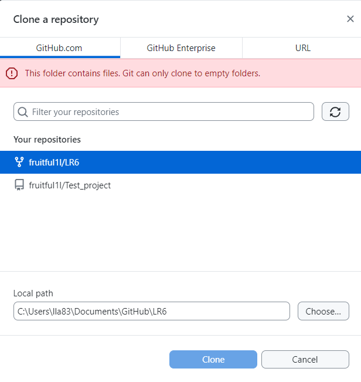
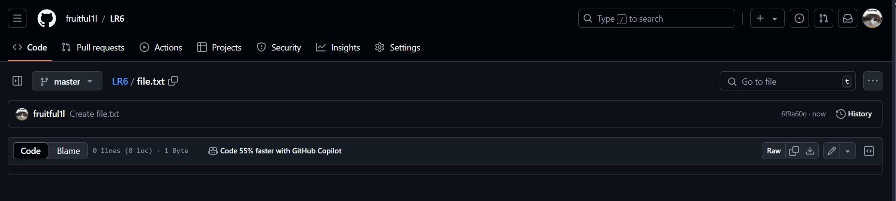
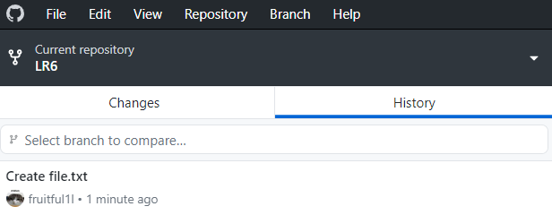
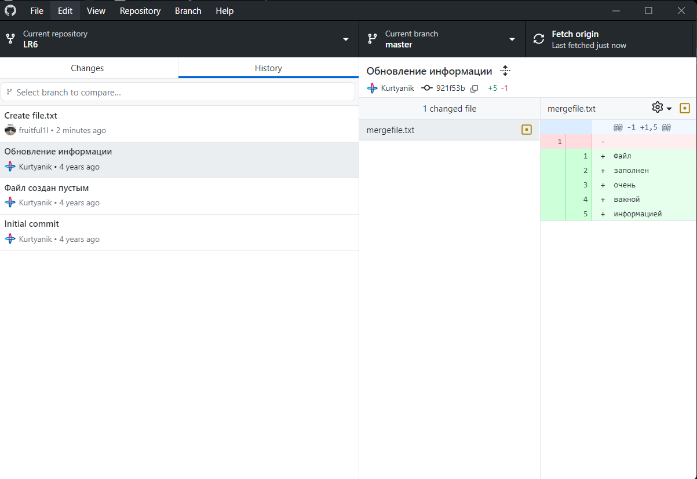
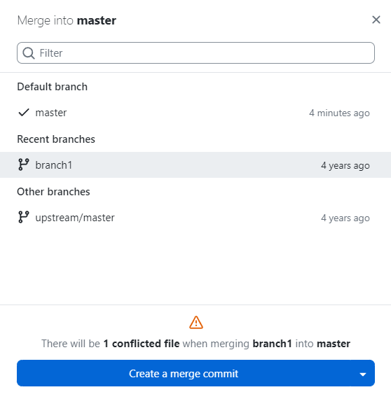
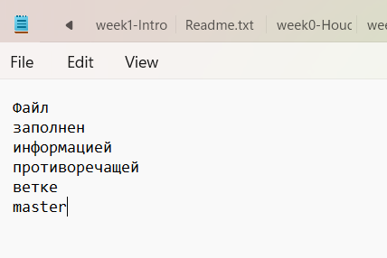
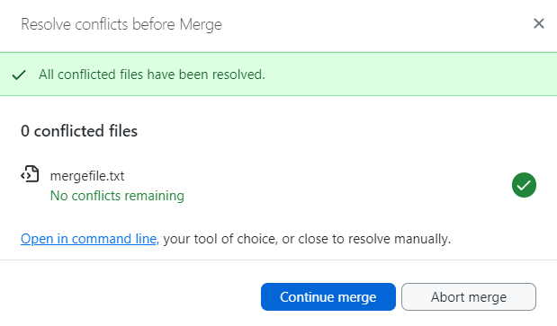
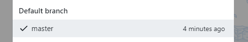

# LR6
Лабораторная работа №6

__Цель лабораторной работы:__ изучение базовых возможностей системы управления версиями, получение опыта работы с Git Api, опыта работы с локальным и удаленным репозиторием.

__Клонирование репозитория на компьютер__



__Добавление файла в репозиторий средствами GitHub__



__Подтягиваем изменения в локальный репозиторий__



__История операций для ветки master__



__Попытка слияния__



__Разрешение конфликта слияния__

В процессе разрешения конфликта слияния было принято решение изменить mergefile.txt в master



__Коммит о слиянии веток__



__Удаление ветки__



__Создание ветки для отчёта__


История операций:
```
372eeec 2024-10-23 fruiful1l Отчет
ded3fc4 2024-11-29 fruiful1l Имена скриншотов
3c9e8c6 2024-11-29 fruiful1l Добавлены скриншоты
c624130 2024-10-23 fruiful1l Merged branch1
6f9a60e 2024-10-23 fruiful1l Create file.txt
921f53b 2020-11-21 GitHub Обновление информации
0f9f50d 2020-11-21 GitHub Заполнил файл
c08a654 2020-11-21 GitHub Файл создан пустым
3c6e913 2020-11-21 GitHub Initial commit
```
__Вывод:__ Я изучил базовые возможности системы управления версиями, получил опыт работы с Git Api, опыт работы с локальным и удаленным репозиторием.
